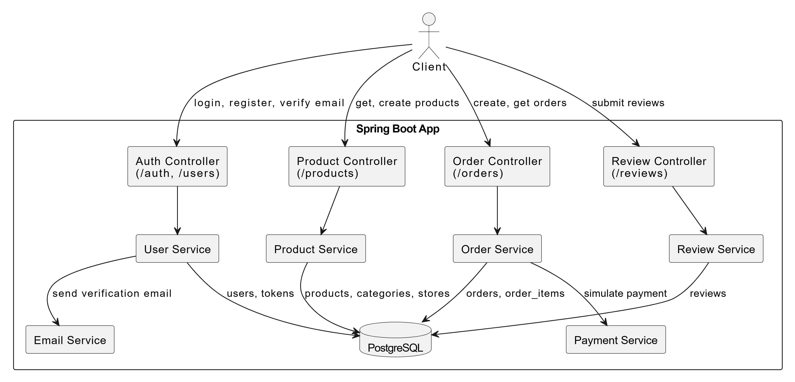

# 📦 Online Marketplace API

This is a **Spring Boot** project for an online marketplace, providing a REST API to manage:

- Users (Admin, Seller, Shopper)
- Stores
- Products
- Orders
- Categories
- Reviews

---

## Features

- JWT Authentication and Authorization
- Role-Based Access Control (`ADMIN`, `SELLER`, `SHOPPER`)
- Email Verification during Registration
- Swagger UI and OpenAPI 3.0 for API Documentation
- Secure Password Hashing with BCrypt
- Clean Layered Architecture (Controller ➔ Service ➔ Repository ➔ DTO ➔ Model)
- Unit and Integration Testing using JUnit and MockMvc
- Spring Caching on Services (using @Cacheable and @CacheEvict)
- Payment Simulation for Order Checkout

---

## Tech Stack

- Java 17+
- Spring Boot 3.x
- Spring Security 6.x
- Spring Data JPA
- PostgreSQL (production) / H2 (testing)
- Swagger / OpenAPI for API docs
- JavaMailSender for Email Verification
- Maven Build Tool

---

## 🛠 Setup Instructions

### 1. Clone the repository

```bash
git clone https://github.com/Neo-Joram/marketplaceAPI.git
cd marketplaceAPI
```

---

### 2. Configure `application.properties`

Update the following settings inside `src/main/resources/application.properties`:

```properties
# Database
spring.datasource.url=jdbc:postgresql://dpg-d075athr0fns7387v630-a/oma_db
spring.datasource.username=oma_db_user
spring.datasource.password=nBayXnUAaGTQOLB0EjVpZp42QFx6gmbt
spring.datasource.driver-class-name=org.postgresql.Driver
spring.jpa.hibernate.ddl-auto=update

# Mail
spring.mail.host=smtp.gmail.com
spring.mail.port=587
spring.mail.username=your-email@gmail.com
spring.mail.password=your-app-password
spring.mail.properties.mail.smtp.auth=true
spring.mail.properties.mail.smtp.starttls.enable=true
```

---

### 3. Build and Run

```bash
./mvnw clean install
./mvnw spring-boot:run
```

API will be available (Online) at:

```
https://marketplaceapi-hln1.onrender.com/
```

Swagger UI:

```
https://marketplaceapi-hln1.onrender.com/swagger-ui/index.html#/
```

---

## API Overview

- POST `/auth` - Login
- GET `/auth` - Get Authenticated User
- POST `/users` - Register User
- GET `/products` - Browse Products
- POST `/products` - Create Product (Seller Only)
- POST `/orders` - Create Order (Shopper Only)
- POST `/reviews` - Submit Review (after purchase)
---

## Docker (optional)

Create a `Dockerfile`:

```dockerfile
FROM maven:3.8.5-openjdk-17 AS build
COPY . .
RUN mvn clean package -DskipTests

FROM openjdk:17.0.1-jdk-slim
LABEL authors="Yoramu"
COPY --from=build /target/OnlineMarketplaceAPI-0.0.1-SNAPSHOT.jar OnlineMarketplaceAPI.jar
EXPOSE 8080
ENTRYPOINT ["java", "-jar", "OnlineMarketplaceAPI.jar"]
```

Build and run:

```bash
docker build -t online-marketplace-api .
docker run -p 8080:8080 online-marketplace-api
```

Run tests (unit + Integration)

```bash
./mvnw clean test
```
---

## System architecture diagram 
```

```

## Author

- Neo Joram (Me!)
- Software Engineer
